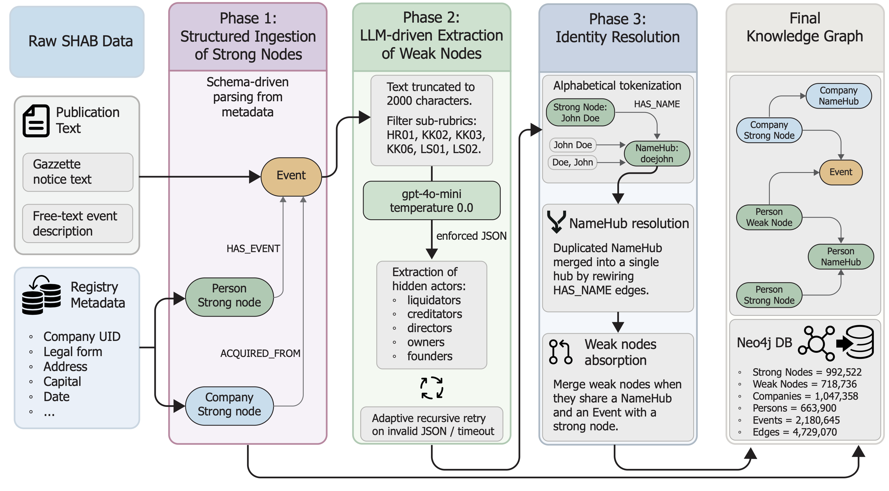
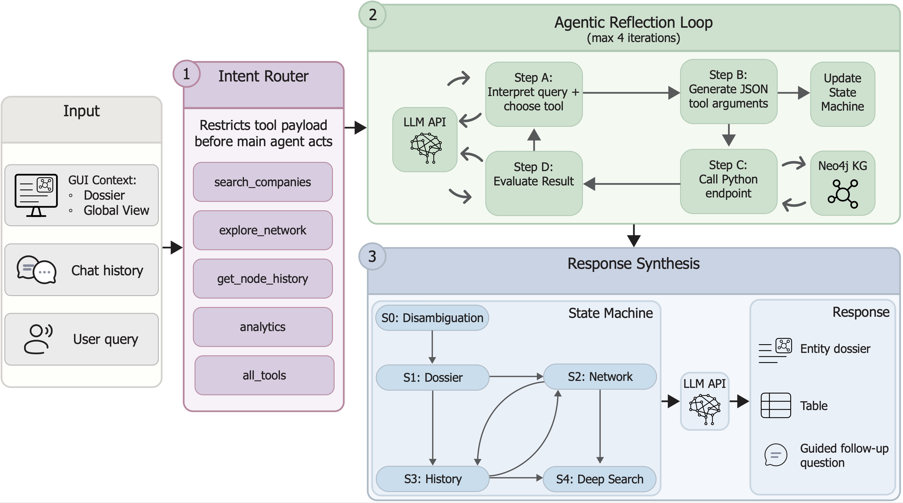

# Agentic Graph Retrieval-Augmented Generation for Commercial Registry Analysis

This repository contains the complete implementation used in the paper:

- `data_collection/`: SHAB public API downloader.
- `agenticGraphRAG/`: core graph and agent architecture.
- `scripts/`: pipeline execution and Neo4j ingestion entrypoints.
- `api/`: FastAPI backend.
- `frontend/`: Next.js dashboard.
- `evaluation/`: Tier 1-4 evaluation scripts, baseline, and datasets.

## Repository Structure

```text
.
├── agenticGraphRAG/
├── api/
├── data_collection/
├── evaluation/
│   ├── baseline_rag/
│   └── datasets/
├── frontend/
├── scripts/
└── README.md
```

## Architecture Overview

### Data Ingestion Pipeline

The knowledge graph is built through a three-phase ingestion pipeline designed for mixed commercial-registry data (structured metadata + unstructured legal text). In **Phase 1**, schema-driven parsing creates **strong nodes** (`Company`, `Person`, `Event`) directly from verified registry fields. In **Phase 2**, an LLM processes selected high-value event texts and extracts latent actors (for example, liquidators and creditors) as **weak nodes** under constrained JSON output. In **Phase 3**, identity resolution applies deterministic alphabetical tokenization (`generate_hub_key`) and links names to `NameHub` anchors, then performs hub deduplication and weak-node absorption to compress duplicate structures.

This design separates deterministic ingestion from probabilistic extraction, then resolves both layers in-database with Cypher cleanup. The result is a deduplicated Neo4j graph optimized for multi-hop traversal, temporal analysis, and reliable entity disambiguation.



### Analytical Agent Architecture

The agent is implemented as a controlled three-stage architecture. First, a zero-shot **intent router** classifies the user request and restricts the available tool set to avoid tool overload. Second, a bounded **agentic reflection loop** (max 4 iterations) iteratively chooses a secure endpoint, generates JSON arguments, executes Neo4j-backed retrieval, and incorporates deterministic backend feedback after each call. Third, **response synthesis** is constrained by a strict state machine that tracks conversational progression (for example, disambiguation, dossier, network/history exploration, and deep-text fallback) and injects routing instructions before the final answer is rendered.

This separation of routing, tool execution, and synthesis improves reliability and auditability in expert workflows. It prevents uncontrolled query behavior, enforces read-only safety constraints for custom Cypher, and keeps the final response grounded in an explicit execution trajectory visible in the dashboard.



## 1) System Requirements

- Python 3.9+
- Node.js 18+
- Neo4j 5+
- OpenAI API key

## 2) Installation

### Python

```bash
python -m venv .venv
source .venv/bin/activate
pip install -r requirements.txt
```

### Frontend

```bash
cd frontend
npm install
cd ..
```

## 3) Environment Variables

Export in the same shell used for running scripts:

```bash
export OPENAI_API_KEY="your_openai_key"
export NEO4J_URI="bolt://localhost:7687"
export NEO4J_USER="neo4j"
export NEO4J_PASSWORD="your_neo4j_password"
export NEO4J_DATABASE="shabdb"
```

Optional downloader settings:

```bash
export SHAB_START_DATE="2018-09-02"
export SHAB_END_DATE="2025-12-31"
export SHAB_OUTPUT_DIR="/abs/path/to/shab_data"
export SHAB_DELAY_SEC="1"
```

Optional ingestion anonymization settings:

```bash
export ANONYMIZE_DATA="true"
export ANONYMIZATION_SECRET_KEY="your_strong_secret"
export ANONYMIZATION_OUTPUT="/abs/path/to/processed_data/anonymization_mapping.json"
```

Optional evaluation output location:

```bash
export EVAL_OUTPUT_DIR="/abs/path/to/evaluation_outputs"
```

## 4) Neo4j Setup

Use Neo4j Desktop or Docker.

Example Docker setup:

```bash
docker run -d \
  --name shab-neo4j \
  -p 7474:7474 -p 7687:7687 \
  -e NEO4J_AUTH=neo4j/your_neo4j_password \
  neo4j:5
```

Create the target database:

```cypher
CREATE DATABASE shabdb IF NOT EXISTS;
```

## 5) Data Collection

Download raw SHAB pages and monthly CSVs:

```bash
python data_collection/download_data.py
```

## 6) Build Graph Checkpoints (CSV -> JSON)

```bash
export INPUT_GLOB="/abs/path/to/shab_data/*"
export OUTPUT_DIR="/abs/path/to/processed_data/processed_graph_data_archive"
export MAX_WORKERS="4"
python scripts/run_job_parallel.py
```

## 7) Ingest Checkpoints into Neo4j (JSON -> Graph)

```bash
export PROCESSED_GRAPH_DIR="/abs/path/to/processed_data/processed_graph_data_archive"
python scripts/ingest_db.py
```

With anonymization enabled:

```bash
export ANONYMIZE_DATA="true"
export ANONYMIZATION_SECRET_KEY="your_strong_secret"
python scripts/ingest_db.py
```

Ingestion pipeline stages:

1. Constraints and indexes
2. Checkpoint ingestion
3. NameHub deduplication
4. Weak-node resolution
5. Optional privacy abstraction (`anonymize_graph`)
6. Graph analytics (`risk_rank`, `community_id`)

## 8) Run the Backend API

```bash
cd api
uvicorn main:app --reload --host 0.0.0.0 --port 8000
```

API docs: [http://localhost:8000/docs](http://localhost:8000/docs)

## 9) Run the Dashboard

In a second terminal:

```bash
cd frontend
cp .env.example .env.local
npm run dev
```

Open: [http://localhost:3000](http://localhost:3000)

## 10) Evaluation Datasets

Evaluation datasets are stored in `evaluation/datasets/`:

- `automated_dataset.json` (300-question automated dataset)
- `golden_dataset.json` (60-question human benchmark)
- `conversational_dataset.json` (multi-turn benchmark)

To regenerate the automated dataset:

```bash
python evaluation/generate_dataset.py
```

## 11) Baseline Vector Model and Vector DB

Initialize or rebuild baseline vector DB from Neo4j:

```bash
python evaluation/baseline_rag/initialize_rag.py --reset
```

Use without reset to resume:

```bash
python evaluation/baseline_rag/initialize_rag.py
```

## 12) Run Evaluation Tiers

### Tier 1 (Entity Resolution)

```bash
python evaluation/tier1_entity_resolution.py
```

### Tier 2 (Agent Trajectories / Tool Behavior)

```bash
python evaluation/tier2_trajectory.py
```

### Tier 3 (Automated + Human Benchmarks)

```bash
python evaluation/run_tier3.py --dataset both
```

Optional quick runs:

```bash
python evaluation/run_tier3.py --dataset automated --limit 50
python evaluation/run_tier3.py --dataset human --limit 20
```

### Tier 4 (Conversational Evaluation)

```bash
python evaluation/tier4_conversational_eval.py
```

## 13) Consolidated Metrics Summary

Generate a single summary JSON across available tier outputs:

```bash
python evaluation/compute_stats.py
```

Output file:

- `${EVAL_OUTPUT_DIR:-evaluation}/evaluation_summary.json`
